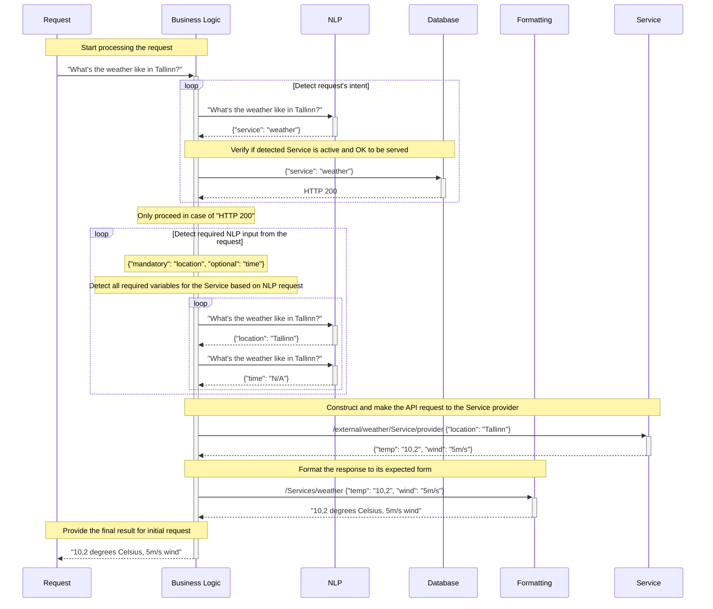

### Initiate Service

This is a happy path for triggering Services based on End Client's natural language input.

```mermaid
sequenceDiagram

participant Request
participant Ruuter as Business Logic
participant NLP
participant Database
participant Formatting
participant Service

note over Request, Ruuter: Start processing the request
Request ->>+ Ruuter: "What's the weather like in Tallinn?"
    loop Detect request's intent
        Ruuter ->>+ NLP: "What's the weather like in Tallinn?"
        NLP -->>- Ruuter: {"service": "weather"}

        note over Ruuter, Database: Verify if detected Service is active and OK to be served

        Ruuter ->>+ Database: {"service": "weather"}
        Database -->>- Ruuter: HTTP 200
    end

    note over Ruuter: Only proceed in case of "HTTP 200"

    loop Detect required NLP input from the request
        note over Ruuter: {"mandatory": "location", "optional": "time"}
        
        note over Ruuter: Detect all required variables for the Service based on NLP request

        loop 
            Ruuter ->>+ NLP: "What's the weather like in Tallinn?"
            NLP -->>- Ruuter: {"location": "Tallinn"}

            Ruuter ->>+ NLP: "What's the weather like in Tallinn?"
            NLP -->>- Ruuter: {"time": "N/A"}
        end
    end

    note over Ruuter, Service: Construct and make the API request to the Service provider
    Ruuter ->>+ Service: /external/weather/Service/provider {"location": "Tallinn"}
    Service -->>- Ruuter: {"temp": "10,2", "wind": "5m/s"}

    note over Ruuter, Formatting: Format the response to its expected form
    Ruuter ->>+ Formatting: /Services/weather {"temp": "10,2", "wind": "5m/s"}
    Formatting -->>- Ruuter: "10,2 degrees Celsius, 5m/s wind"

    note over Ruuter, Request: Provide the final result for initial request
Ruuter -->>- Request: "10,2 degrees Celsius, 5m/s wind"
```
