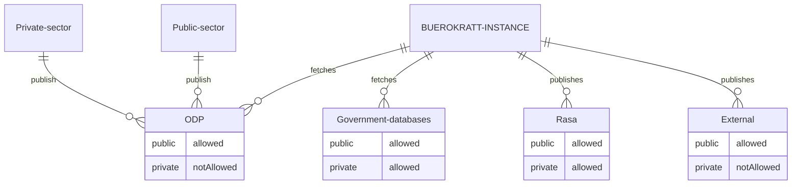

### Data population

#### Legend

By `Bürokratt's instances` we consider every institution using Bürokratt, e.g. the Information System Authority of Estonia

`Admin` is every Bürokratt's instance's own administrator having acces to their Bürokratt's instances based on defined rules

`ODP` stands for Open Data Portal

`Rasa` is every Bürokratt's instance's own local Rasa, which only they can access

`External` is an external service provider hosting data, LLMs, etc. outside of Bürokratt's instances control

#### Concept

All Bürokratt's instances have full control over the data they use to train both their local and external chatbots and/or LLMs. Bürokratt does not have any control over it.

When publishing data for training, the rule of thumb is that no private data may be published on private clouds. If done otherwise, Bürokratt can not have any control over it, but we will create mechanisms to do as much validations and user guiding as possible to prevent such situations.

