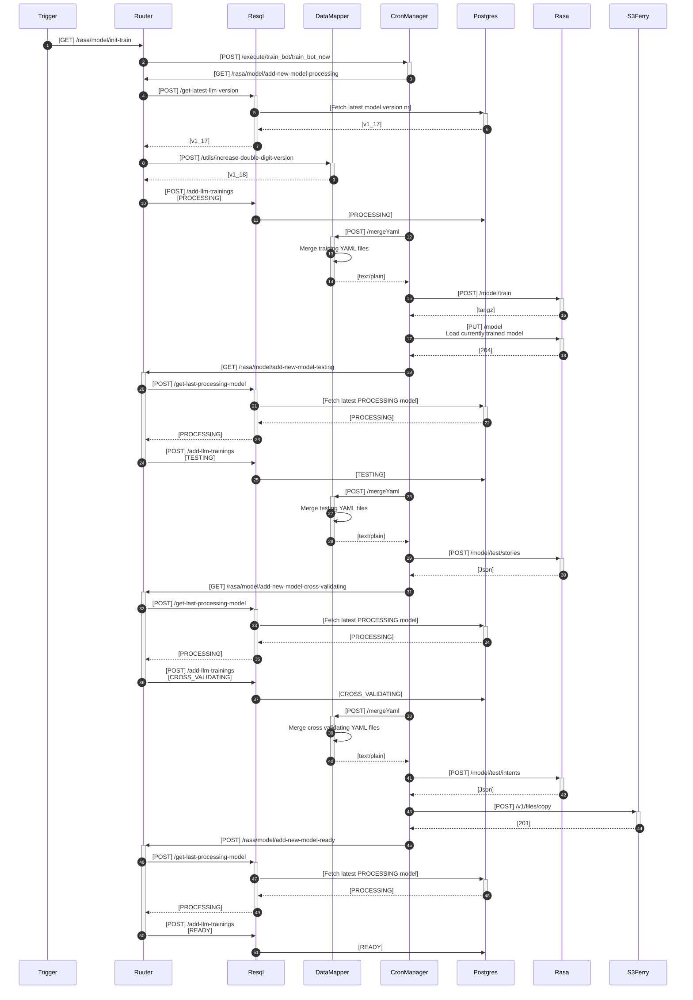

### Sequence diagram

```mermaid
sequenceDiagram

participant Trigger
participant Ruuter
participant Resql
participant DataMapper
participant CronManager
participant Postgres
participant Rasa
participant S3Ferry

autonumber
Trigger->>Ruuter: [GET] /rasa/model/init-train

Ruuter->>+CronManager: [POST] /execute/train_bot/train_bot_now
CronManager->>-Ruuter: [GET] /rasa/model/add-new-model-processing

Ruuter->>+Resql: [POST] /get-latest-llm-version
Resql->>+Postgres: [Fetch latest model version nr]
Postgres-->>-Resql: [v1_17]
Resql-->>-Ruuter: [v1_17]

Ruuter->>+DataMapper: [POST] /utils/increase-double-digit-version
DataMapper-->>-Ruuter: [v1_18]

Ruuter->>Resql: [POST] /add-llm-trainings<br>[PROCESSING]
Resql->>Postgres: [PROCESSING]

CronManager->>+DataMapper: [POST] /mergeYaml
DataMapper->>DataMapper: Merge training YAML files
DataMapper-->>-CronManager: [text/plain]

CronManager->>+Rasa: [POST] /model/train
Rasa-->>-CronManager: [tar.gz]

CronManager->>+Rasa: [PUT] /model<br> Load currently trained model
Rasa-->>-CronManager: [204]

CronManager->>+Ruuter: [GET] /rasa/model/add-new-model-testing
Ruuter->>+Resql: [POST] /get-last-processing-model
Resql->>+Postgres: [Fetch latest PROCESSING model]
Postgres-->>-Resql: [PROCESSING]
Resql-->>-Ruuter: [PROCESSING]
Ruuter->>-Resql: [POST] /add-llm-trainings<br>[TESTING]
Resql->>Postgres: [TESTING]

CronManager->>+DataMapper: [POST] /mergeYaml
DataMapper->>DataMapper: Merge testing YAML files
DataMapper-->>-CronManager: [text/plain]

CronManager->>+Rasa: [POST] /model/test/stories
Rasa-->>-CronManager: [Json]

CronManager->>+Ruuter: [GET] /rasa/model/add-new-model-cross-validating
Ruuter->>+Resql: [POST] /get-last-processing-model
Resql->>+Postgres: [Fetch latest PROCESSING model]
Postgres-->>-Resql: [PROCESSING]
Resql-->>-Ruuter: [PROCESSING]
Ruuter->>-Resql: [POST] /add-llm-trainings<br>[CROSS_VALIDATING]
Resql->>Postgres: [CROSS_VALIDATING]

CronManager->>+DataMapper: [POST] /mergeYaml
DataMapper->>DataMapper: Merge cross validating YAML files
DataMapper-->>-CronManager: [text/plain]

CronManager->>+Rasa: [POST] /model/test/intents
Rasa-->>-CronManager: [Json]

CronManager->>+S3Ferry: [POST] /v1/files/copy
S3Ferry-->>-CronManager: [201]

CronManager->>+Ruuter: [POST] /rasa/model/add-new-model-ready
Ruuter->>+Resql: [POST] /get-last-processing-model
Resql->>+Postgres: [Fetch latest PROCESSING model]
Postgres-->>-Resql: [PROCESSING]
Resql-->>-Ruuter: [PROCESSING]
Ruuter->>-Resql: [POST] /add-llm-trainings<br>[READY]
Resql->>Postgres: [READY]

```
