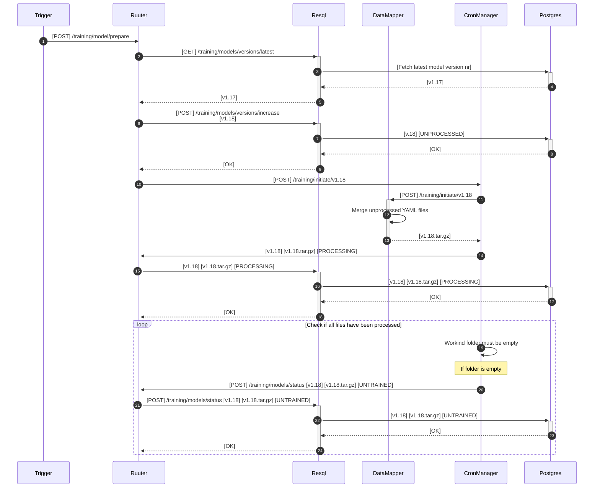
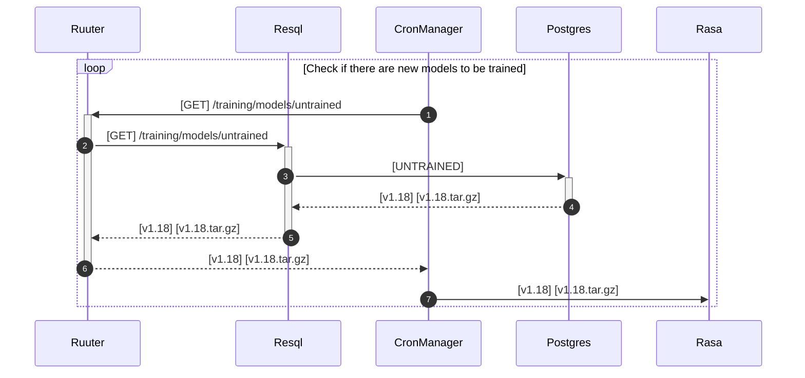
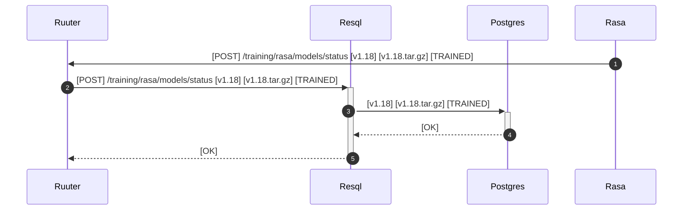

### Prepare training data for training

> Participant `Trigger` can be initiated via `GUI`, `CronManager`, or other similar

    

### Check if there are any models to be trained

    

### Mark the training process as final

    

### Deployment of newly trained model

_TBA_
