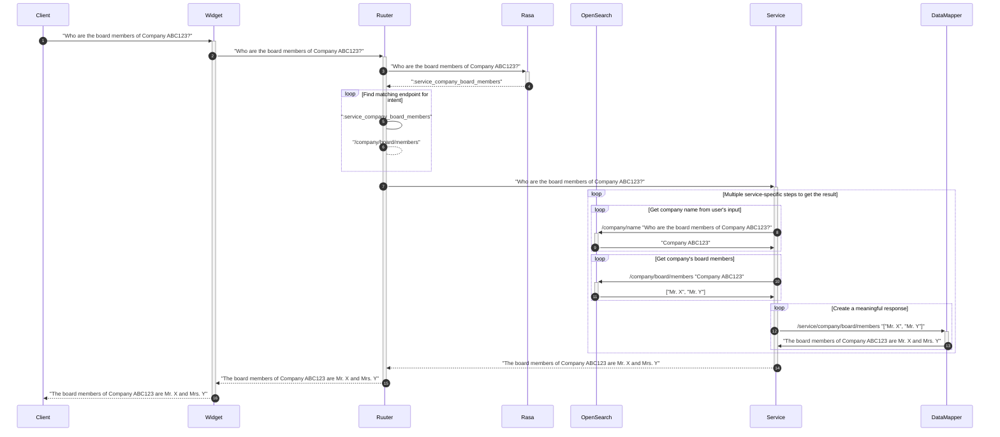

### Data journey

This is to give an overview of a data journey when the End Client is trying to use common services provided by Bürokratt.

`Service` in this case is considered as a standard Ruuter DSL. It's separated on a sequance diagram as it could technically also be any external REST service.

#### User case nr 1 - company's name can be exactly detected based on End Client's initial text input

